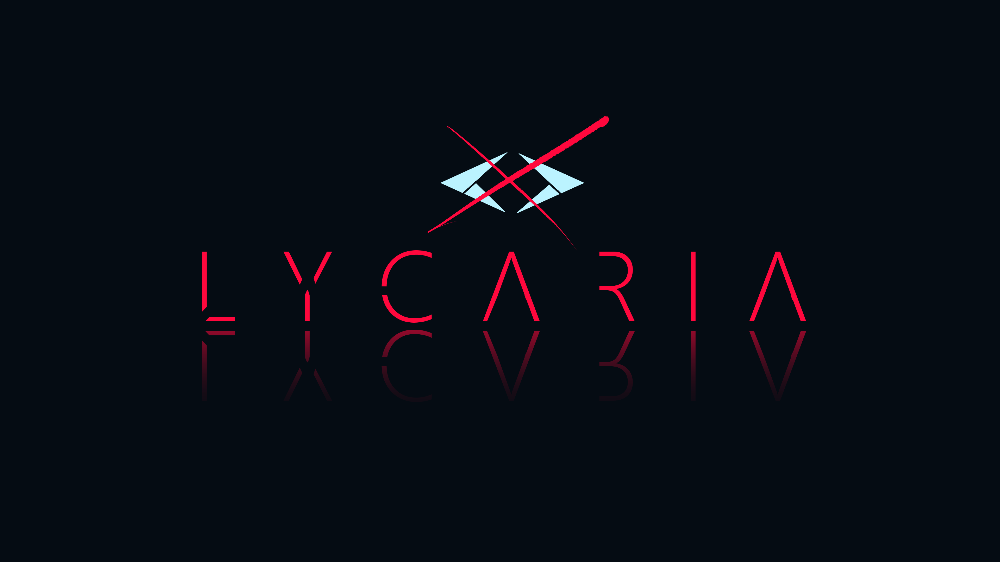

<h1 align="center">
   
    
   
    LYCARIA (BACKEND) 👁️
   
</h1>

<h4 align="center">An online turn-based game (this repository concerns the server) created with <a href="https://expressjs.com/pt-br/" target="_blank">Express</a> and <a href="https://www.colyseus.io/" target="_blank">Colyseus</a></h4>

  <a href="https://github.com/niloodev/lycaria-project-game/blob/main/lycaria-art.pdf">ArtBook</a> •
  <a href="#proposal">Proposal</a> •
  <a href="#tools">Tools</a> •
  <a href="#author">Author</a>

  <a href="https://github.com/niloodev/lycaria-project-server">> Server <</a> •
  <a href="https://github.com/niloodev/lycaria-project-client">Client (Reactron)</a> •
  <a href="https://github.com/niloodev/lycaria-project-game">Game (Unity)</a>

> ☕ Developer: [niloodev](https://github.com/niloodev) • 🎨 Lead Designer: [Axel Galzz](https://twitter.com/axelgalzz) • 🐻 Animation and Pixel Designer: [VamnKuma](https://twitter.com/vamnkuma) • 🎵 Soundtrack: [Izábi Ferros](https://www.youtube.com/channel/UCzyddgAW2lqBUp_S6cy8ZJQ)

## Proposal
Project developed by; Ezequiel Nilo (Programming), Axel Galz (Design), VamnKuma (Animation and Pixel ART) and Izábi Ferros (Soundtrack).

Lycaria is a turn-based online game, it is divided in three parts; the client, server and the game. The project was developed with the intention of creating a simple and light form of entertainment for potential players, while developing a complex story behind it.

*The TCC (course conclusion project) was presented and delivered on 06/12/2021 as a project from Analysis and Systems Development technical course in ETEC Antônio de Pádua Cardoso.*

* The application back-end must match all the necessities, providing a route for **/login**, **/register** and API Rest services in general.
* Be capable of maintaning multiple players connected to a WebSocket room. (Called **Lobby**)
* Handle game logic as necessary, since the game is turn based.
* One client per account.
* Store all players info in MongoDB non-relational database, and keep it synced to WebSocket. (Players connect and disconnect actions updates the database with the info)
* Must have a standart security, sufficient to keep players safe.

## Tools

This application uses the following open-source packages:

##### Core ones.
- [Express](https://expressjs.com/pt-br/) (API framework)
- [Colyseus](https://www.colyseus.io/) (Game server template made in WebSocket and Typescript, IT WAS REALLY GOOD in server development and I recommend it)

##### Authentication.
- [JsonWebToken or JWT](https://github.com/auth0/node-jsonwebtoken) (Create user section and codify it)
- [BCrypt](https://www.npmjs.com/package/bcrypt) (Encrypt password to send to database)

##### Data management.
- [MongoDB](https://www.mongodb.com/pt-br) (Non-relational database)
- [Mongoose](https://mongoosejs.com/) (Compact client for MongoDB)
- [Nodemailer](https://nodemailer.com/about/) (Sending emails 💌)

##### Environment and testing tools.
- [Nodemon](https://www.npmjs.com/package/nodemon) (Auto restart the Node application when an archive changes.)
- [@Colyseus/Monitor](https://docs.colyseus.io/colyseus/tools/monitor/) (Shows the current rooms of Colyseus and display some options, like an admin panel)

## Author
**code made by niloodev | Ezequiel Nilo**

**ANY TIPS OR FEEDBACK IS HIGHLY APPRECIATED! 🐸**

